

# Fraud Detection Project

### :brazil: [Versão em Português](https://github.com/FelipeLRoll/prevencao-fraudes/edit/main/readmePortugues.md)
### Inspired by: [Fraud Detection](https://www.youtube.com/watch?v=r9aBF7dWX00)

# Project Overview
This project focuses on building a machine learning model to predict potential fraud in financial transactions. The dataset includes various features related to loans and customers, such as:

- Age
- Gender
- Income
- Loan amount
- Repayment history

The goal is to classify transactions as either potentially fraudulent or non-fraudulent, with the target column being **"Possivel_Fraude"**.
# Key Features:
- **Type of problem**: Classification
- **Process**: Data exploration, treatment, feature engineering, model training, evaluation, and tuning

# Tools & Resources Used:
- **Development Tools**: Jupyter Notebook, Git, GitHub, Visual Studio Code
- **Project Management**: Poetry
- **Programming Language**: Python (>=3.12, <3.13)
- **Libraries**:
  - `pandas ^2.2.2`
  - `scikit-learn ^1.5.1`
  - `imbalanced-learn ^0.12.3`
  - `numpy >=1.26.0, <2.0.0`
  - `plotly-express ^0.4.1`
  - `openpyxl ^3.1.5`
  - `streamlit ^1.38.0`
  - `streamlit-dynamic-filters = "^0.1.9"`
  - `langchain-google-genai = "^1.0.10"`
  - `langchain-experimental = "^0.0.65"`
  - `tabulate = "^0.9.0"`

# Project Steps:
  * ## Exploratory Data Analysis
     - Here we take a look at our dataset, to understand the structure and patterns. We detect some errors like the minimum value of "Idade"  being only 4 and some possible outliers in the "Valor_Renda" that will be looked at and treated in the next step.

  * ## Data Treatment
    - This step focused on cleaning and preprocessing the data, we also optimized the columns to reduce the size of the dataset. This step had some of the following treatments:
      -  Ordering some columns to give a sense of increased importance to the different types of values;
      -  Removing duplicate lines;
      -  Grouping values and creating intervals;

  * ## Visualization with *Plotly Express*
    - Here many charts were made to better visualize our data and help us understand it better

    ### **Clients by State**
    
    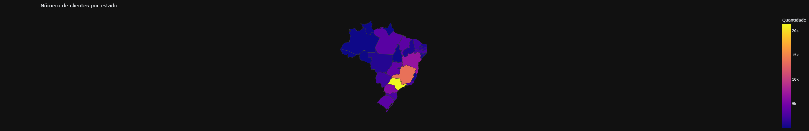
    - São Paulo has the most number of clients on this dataset
      

    ### **Outstanding Balance by Sex**

    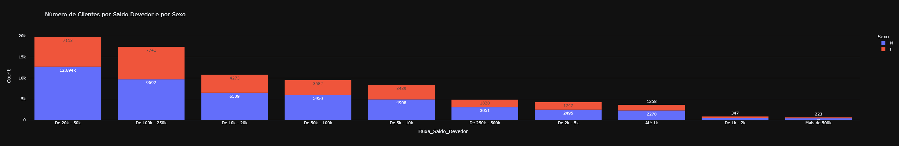
    - Most of the people whose outstanding balance are between 20-50k, are men

    ### **Payments on time x Late**

    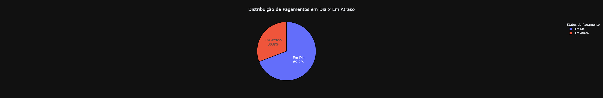
    - Most of the payments are paid on time
    
    
  * ## Second Data Treatment
    - Here we delete the columns that wont be part of our model and look for missing values.
    
  * ## Exploratory Data Analysis with Categorical Columns
    - Here we take a closer look to Categorical Columns, creating histograms to visualize patterns and how they behave. We also observe that there is a tendency on our data when the column "Total_Pago" is greater than 60K, there is a high chance that it is not a fraud.
    
    ### **Possible Fraud by Marital Status**
    
    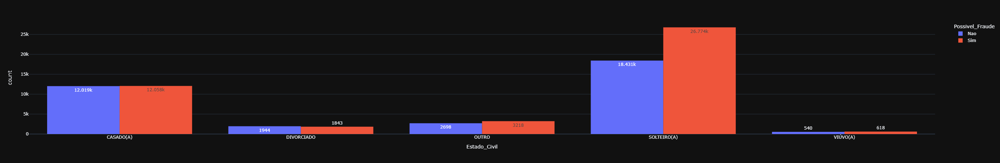
    - The higher number of possible frauds, are in the Single category

    ### **Possible Fraud by Salary**
    
    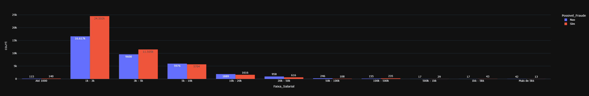
    - The higher number of possible frauds, are in the 1-3k Salary range

    ### **Possible Fraud by Sex**
    
    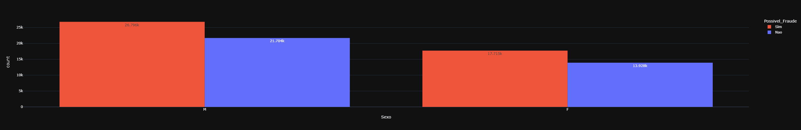
    - The higher number of possible frauds, are by men, but, Women have 56% of total Possible Fraud(filtered by Women) being Yes, while Men(filtered by Men) have 55%
    
  * ## Exploratory Data Analysis with Numerical Columns
    - The Objective here is to observe correlation between Numerical Columns, we find that "VL_Emprestimo" and "VL_Emprestimo_ComJuros" have a high positive correlation, and, "QT_Parcelas_Atraso" and "QT_Total_Parcelas_Pagas" have a high negative correlation, this will be fixed in the normalization of out data. We also took a look at outliers, median, max and min values using boxplots.

    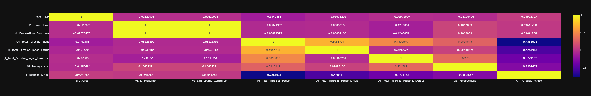
    
  * ## OneHotEncoding
    - Here we split our data to use *Ordinal Encoding* for columns without a specific order, and *OneHotEncoding* for columns that have. This is crucial in order to train our model, this step transforms our data in numerical values to be used later.
    
  * ## Balacing the Target Column
    - This step splits the data in the Target Column and the rest of the dataset, creating two datasets in order to balance out the Target Column using *SMOTE*, this help the machine learning model to not be biased towards one of the possible results.

    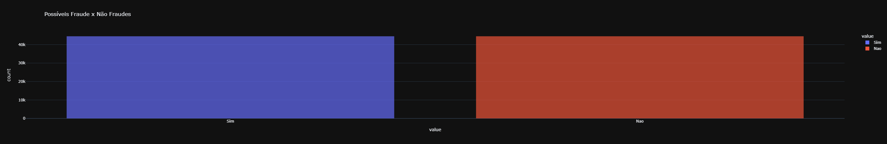
    
  * ## Scaling the data with *RobustScaler*
    - Here we test Padroniztion, Standardization and the *RobustScaler* in order to put our numerical values in the same scale and not create a bias for our model. After testing with all three methods, we chose to use *RobustScaler* because we decided to leave some outliers in our data. We also split the data in *train* and *test*
    
  * ## Model Creation, Hyperparameter Tunning, Training and Evaluation
    - This step creates out Machine Learning Models that are going to be trained with our data, hyperparameters are also manualy assigned here. The three models used are *Random Forest Classifier*, *Support Vector Machine* and *K Neighbors Classifier*. We tested the **Accuracy**, **Best Hyperparameters**, **Training Time(in seconds)** and **Number of Total Trainings Made** for each of our models, having *K Neighbors Classifier* as the best model with an accuracy of 99.33%.

# Results:
Predicted results can be found in **previsao/previsoes.xlsx**.
 
- **Random Forest**:  
  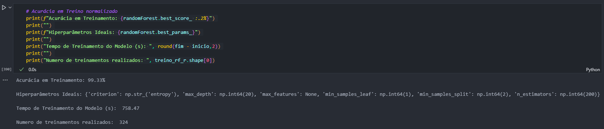
  
- **SVM**:  
  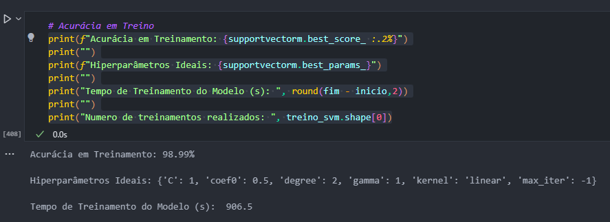

- **KNN**:  
  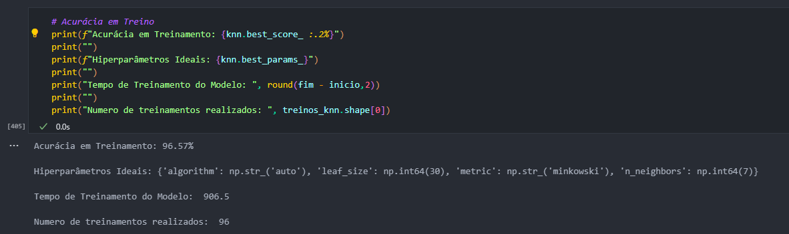

- **Overall Results**:  
  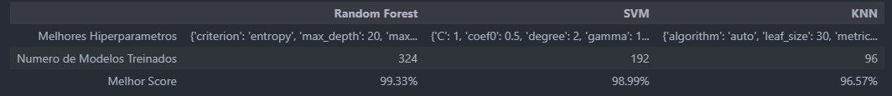

- **Feature Importance**:  
  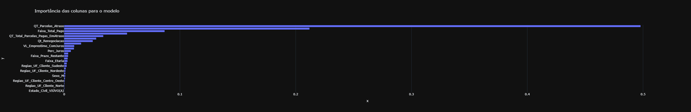
  
# Additional Resources:
- **Dashboard**: [Power BI Report](https://app.powerbi.com/reportEmbed?reportId=ba0459e9-5520-4b20-a76c-be442c03b13a&autoAuth=true&ctid=f310b526-e195-4805-a55e-67e28f2fefdb)
- **Streamlit App (In Portuguese)**: [Fraud Detection](https://prevencao-fraudes.streamlit.app/)
  - **Home**: Homepage of the WebApp
  - **Dataframe**: View and filter the dataframe
  - **Charts**: Create and interact with custom charts
  - **Dashboard**: View the integrated dashboard
  - **AI Assistant**: Ask questions about the dataset

# How to use
1. Access the [Fraud Detection Streamlit App](https://prevencao-fraudes.streamlit.app/) OR:
2. Set up a virtual environment using Poetry:
   - Run `poetry install` to install dependencies
   - Use `streamlit run app.py` to start the app

* To make predictions on a new dataset:
   - Run `gerar_modelo.py` to train the model
   - Use `gerar_previsoes.py` to load a new dataset and predict results

# Developed by: 
  * [Felipe Roll - Linkedin](https://www.linkedin.com/in/felipe-roll)
  * [Felipe Roll - Github](https://github.com/FelipeLRoll)
  * [Felipe Roll - Gmail](felipelroll@gmail.com)

