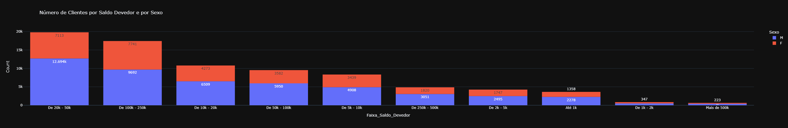
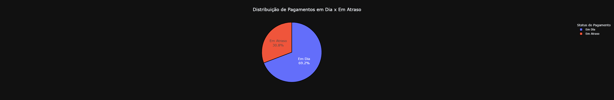
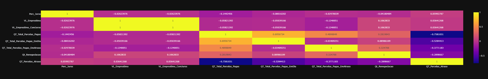
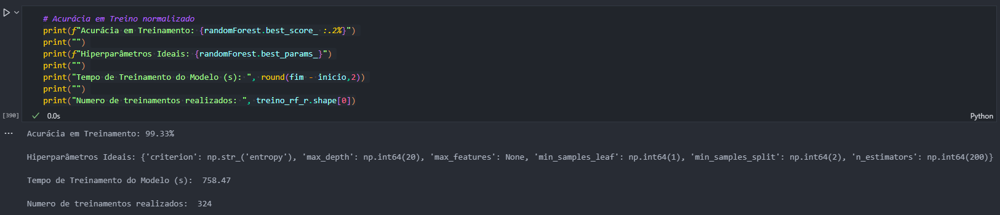
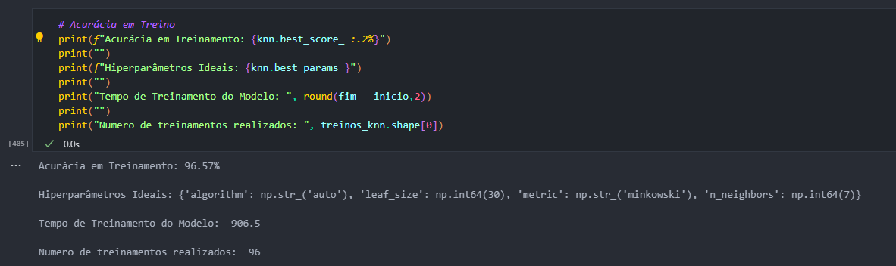
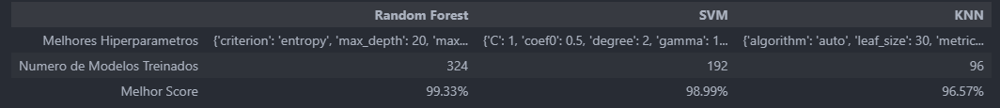

# Projeto de Detecção de Fraudes

### :us: [English Version](https://github.com/FelipeLRoll/prevencao-fraudes/blob/main/readme.md)
### Inspirado por: [Fraud Detection](https://www.youtube.com/watch?v=r9aBF7dWX00)

# Visão Geral do Projeto
Este projeto foca na construção de um modelo de machine learning para prever fraudes potenciais em transações financeiras. O conjunto de dados inclui diversas características relacionadas a empréstimos e clientes, como:

- Idade
- Gênero
- Renda
- Valor do Empréstimo
- Histórico de Pagamentos

O objetivo é classificar as transações como potencialmente fraudulentas ou não fraudulentas, sendo a coluna alvo **"Possivel_Fraude"**.

# Principais Características:
- **Tipo de problema**: Classificação
- **Processo**: Exploração de dados, tratamento, engenharia de atributos, treinamento do modelo, avaliação e ajuste de hyperparâmetros

# Ferramentas e Recursos Utilizados:
- **Ferramentas de Desenvolvimento**: Jupyter Notebook, Git, GitHub, Visual Studio Code
- **Gerenciamento do Projeto**: Poetry
- **Linguagem de Programação**: Python (>=3.12, <3.13)
- **Bibliotecas**:
  - `pandas ^2.2.2`
  - `scikit-learn ^1.5.1`
  - `imbalanced-learn ^0.12.3`
  - `numpy >=1.26.0, <2.0.0`
  - `plotly-express ^0.4.1`
  - `openpyxl ^3.1.5`
  - `streamlit ^1.38.0`
  - `streamlit-dynamic-filters = "^0.1.9"`
  - `langchain-google-genai = "^1.0.10"`
  - `langchain-experimental = "^0.0.65"`
  - `tabulate = "^0.9.0"`

# Etapas do Projeto:
  * ## Análise Exploratória de Dados
     - Aqui analisamos nosso conjunto de dados para entender a estrutura e padrões. Detectamos alguns erros, como o valor mínimo de "Idade" sendo apenas 4 anos e alguns possíveis outliers em "Valor_Renda", que serão analisados e tratados na próxima etapa.

  * ## Tratamento de Dados
    - Esta etapa foca na limpeza e pré-processamento dos dados. Também otimizamos as colunas para reduzir o tamanho do conjunto de dados. Algumas das tratativas incluíram:
      - Ordenação de algumas colunas para proporcionar uma melhor análise dos dados.
      - Remoção de valores inconsistentes ou que comprometiam a integridade do modelo.
      - Agrupamento de valores.

* ## Visualização com *Plotly Express*
    - Aqui, muitos gráficos foram feitos para melhor visualizar nossos dados e ajudar a entendê-los melhor.

    ### **Clientes por Estado**
    
    
    - São Paulo tem o maior número de clientes neste conjunto de dados.
      
    ### **Saldo Devedor por Sexo**

    
    - A maioria das pessoas cujo saldo devedor está entre 20-50k são homens.

    ### **Pagamentos em dia x Atrasados**

    
    - A maioria dos pagamentos são feitos em dia.
    
* ## Segundo Tratamento de Dados
    - Aqui, excluímos as colunas que não farão parte do nosso modelo e procuramos valores ausentes.
    
* ## Análise Exploratória de Dados com Colunas Categóricas
    - Aqui, analisamos mais de perto as colunas categóricas, criando histogramas para visualizar padrões e como elas se comportam. Também observamos que há uma tendência em nossos dados quando a coluna "Total_Pago" é maior que 60K, há uma alta chance de não ser uma fraude.
    
    ### **Possível Fraude por Estado Civil**
    
    
    - O maior número de fraudes possíveis está na categoria Solteiro.

    ### **Possível Fraude por Faixa Salarial**
    
    
    - O maior número de fraudes possíveis está na faixa salarial de 1-3k.

    ### **Possível Fraude por Sexo**
    
    
    - O maior número de fraudes possíveis são por homens, mas, mulheres têm 56% do total de possíveis fraudes (filtrado por mulheres) sendo "Sim", enquanto homens (filtrado por homens) têm 55%.
    
* ## Análise Exploratória de Dados com Colunas Numéricas
    - O objetivo aqui é observar a correlação entre as colunas numéricas. Descobrimos que "VL_Emprestimo" e "VL_Emprestimo_ComJuros" têm uma alta correlação positiva, e "QT_Parcelas_Atraso" e "QT_Total_Parcelas_Pagas" têm uma alta correlação negativa, isso será corrigido na normalização dos nossos dados. Também analisamos outliers, mediana, valores máximos e mínimos usando boxplots.

    
    
* ## OneHotEncoding
    - Aqui, dividimos nossos dados para usar *Ordinal Encoding* para colunas sem uma ordem específica, e *OneHotEncoding* para colunas que têm. Isso é crucial para treinar nosso modelo, essa etapa transforma nossos dados em valores numéricos para serem usados posteriormente.
    
* ## Balanceando a Coluna Alvo
    - Esta etapa divide os dados na Coluna Alvo e o resto do conjunto de dados, criando dois conjuntos de dados para equilibrar a Coluna Alvo usando *SMOTE*, isso ajuda o modelo de aprendizado de máquina a não ser tendencioso para um dos possíveis resultados.

    

    
* ## Escalonamento dos dados com *RobustScaler*
    - Aqui testamos Padronização, Normalização e o *RobustScaler* para colocar nossos valores numéricos na mesma escala e não criar um viés para o nosso modelo. Após testar com todos os três métodos, optamos por usar o *RobustScaler* porque decidimos deixar alguns outliers em nossos dados. Também dividimos os dados em *treino* e *teste*.
    
* ## Criação do Modelo, Ajuste de Hiperparâmetros, Treinamento e Avaliação
    - Esta etapa cria nossos Modelos de Aprendizado de Máquina que serão treinados com nossos dados, hiperparâmetros também são atribuídos manualmente aqui. Os três modelos usados são *Random Forest Classifier*, *Support Vector Machine* e *K Neighbors Classifier*. Testamos a **Acurácia**, **Melhores Hiperparâmetros**, **Tempo de Treinamento (em segundos)** e **Número Total de Treinamentos Realizados** para cada um dos nossos modelos, tendo *K Neighbors Classifier* como o melhor modelo com uma acurácia de 99,33%.

# Resultados:
Os resultados previstos podem ser encontrados em **previsao/previsoes.xlsx**.

- **Random Forest**:  
  
  
- **SVM**:  
  

- **KNN**:  
  

- **Resultados Gerais**:  
  

- **Importância dos Atributos**:  
  
  
# Recursos Adicionais:
- **Dashboard**: [Relatório Power BI](https://app.powerbi.com/reportEmbed?reportId=ba0459e9-5520-4b20-a76c-be442c03b13a&autoAuth=true&ctid=f310b526-e195-4805-a55e-67e28f2fefdb)
- **App Streamlit (Em Português)**: [Fraud Detection](https://prevencao-fraudes.streamlit.app/)
  - **Home**: Página inicial do WebApp
  - **Dataframe**: Visualizar e filtrar o dataframe
  - **Gráficos**: Criar e interagir com gráficos personalizados
  - **Dashboard**: Visualizar o dashboard integrado
  - **Assistente de IA**: Fazer perguntas sobre o conjunto de dados

# Como usar
1. Acesse o [App Streamlit de Detecção de Fraudes](https://prevencao-fraudes.streamlit.app/) OU:
2. Configure um ambiente virtual usando Poetry:
   - Execute `poetry install` para instalar as dependências
   - Use `streamlit run app.py` para iniciar o app

* Para fazer previsões em um novo conjunto de dados:
   - Execute `gerar_modelo.py` para treinar o modelo
   - Use `gerar_previsoes.py` para carregar um novo conjunto de dados e prever resultados

# Desenvolvido por: 
  * [Felipe Roll - Linkedin](https://www.linkedin.com/in/felipe-roll)
  * [Felipe Roll - Github](https://github.com/FelipeLRoll)
  * [Felipe Roll - Gmail](felipelroll@gmail.com)

